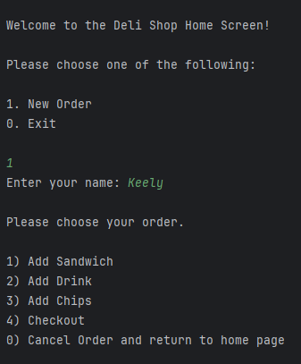
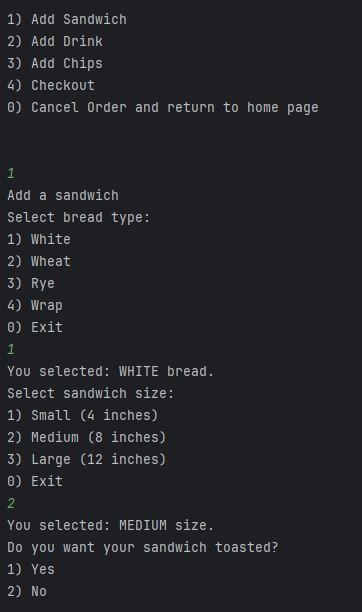
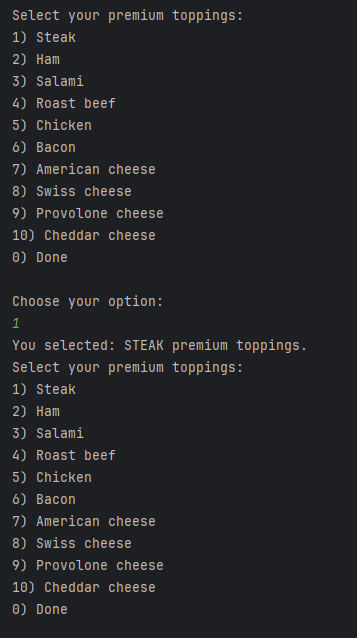
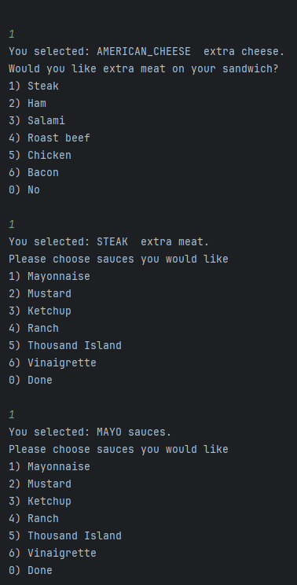
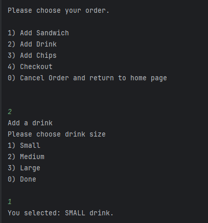
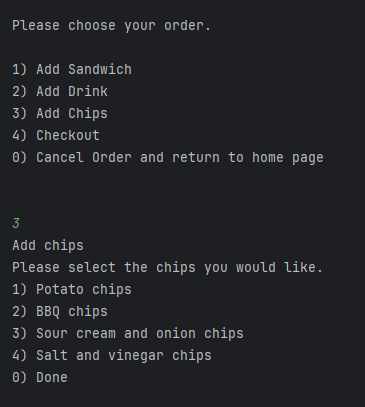
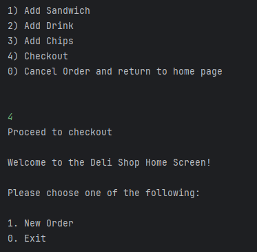
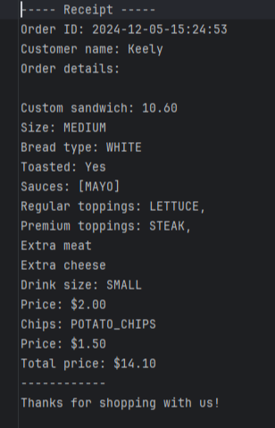
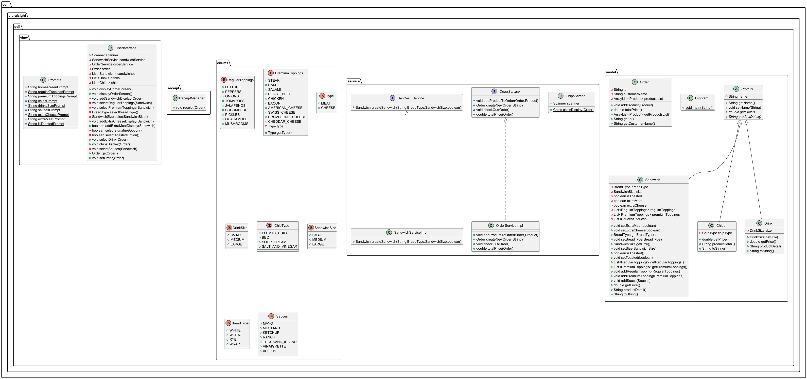

Welcome to Keely's Deli Shop!

This application enables the users to create and customize their own sandwich orders, it allows them to select their preferred custom sandwich, drink, and chips, and generate a receipt.

There are many userface screens that allows the user to select their items.

- First the user is prompted with the home screen which allows them to start a new order.
- Second the user is prompted to enter their name for the receipt
- This then takes the user to the order screen

The user can then choose to create a new sandwich which prompts them to enter their preferred
- Bread type
- Bread size
- If they would like their sandwich toasted
- The premium toppings they would like which allows them to choose multiple
- The regular toppings they would like which allows them to choose multiple
- If they want extra cheese or meat toppings
- Sauces they would like on their sandwich

After they are done it takes them back to the order screen where they can continue finishing their order.

The user is now asked to select their size of drink return back to the order screen.

The user is now asked to select their size of drink return back to the order screen

Once the user is finished with their order they have the option to checkout which generates a receipt of their order details including:
- Time and date the order was placed
- Users name
- Details of the customized sandwich
- Size of the drink
- Chip type
- The calculated total of the users order

Lessons Learned:

- Designing and implementing multiple screens.
- Utilizing inheritance to organize related methods.
- Writing and executing tests to ensure functionality.
- Employing while loops to calculate totals for multiple items.
-Working with enums to manage choices efficiently.

Challenges Faced:

- Writing data to the receipts CSV file.
- Implementing a system for products to process orders and save them to the CSV file.
- Creating an option to allow users to add multiple items to their order.

UML diagram:

